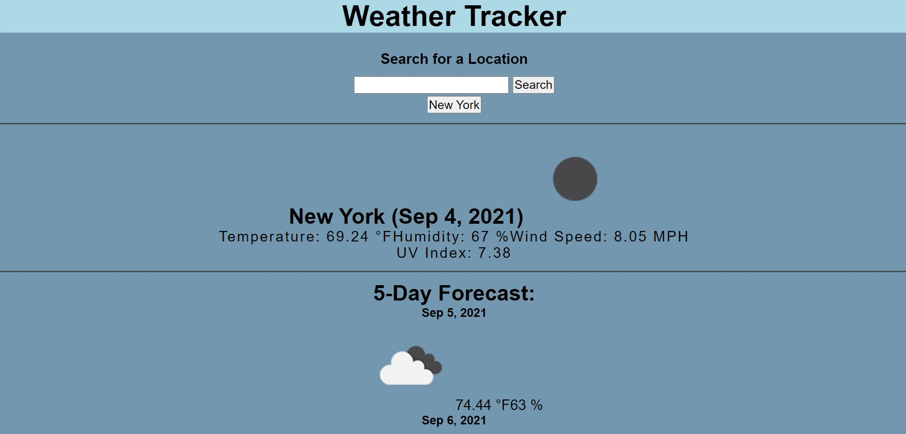

# Weather Tracker

## User Story

A locally stored weather dashboard with dynamically updatd HTML and CSS.

## Acceptance Criteria

The user inputs specific city in the input box then clicks the search button. The search results will pull up the today's current weather, as well as a 5 day forecast.

## Mock-up

## Installation

* Visual Studio Code
* HTML
* CSS
* JavaScript
* Bootstrap
* Momentjs

## Links

Github: <https://github.com/SarahKubik/WeatherTracker.git>

URL: <https://sarahkubik.github.io/WeatherTracker/>
